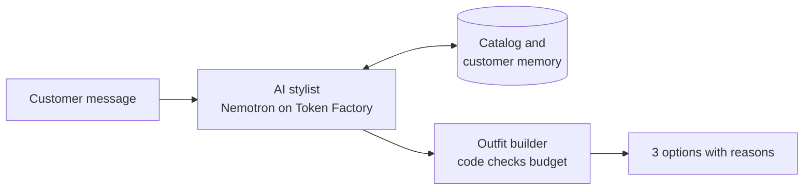

# MahiMind

**An AI stylist for a clothing store.** A customer says the occasion, who it is for, and a budget. MahiMind recalls returning customers, builds a complete outfit from the store's catalog under budget, and explains why it picked each piece.

Built for the **Nebius x NVIDIA Global AI Hackathon** in the **Best Apps and Agents** track.

- Live demo: _add your Vercel URL here_
- Demo video (3 min): _add your YouTube link here_
- License: [MIT](./LICENSE)

> **Status: in development.** The checklist under [Project status](#project-status) shows what works today and what is still planned.

---

## The problem

Buying clothes for an event or as a gift means jumping between shop pages, social media posts and chat groups, comparing prices and guessing someone's taste. Search only works when you already know the product. You usually know *who it is for* and *what the occasion is*.

## What MahiMind does

1. The customer describes the occasion, the person, and the budget. For example: "My sister's mehndi, budget 25,000."
2. The AI stylist asks short follow-up questions (size, colors, style) and recalls what the store already knows about a returning customer.
3. It searches the store's catalog using tools.
4. An outfit builder, written as plain code, assembles a full look (outfit, dupatta, shoes, accessories) and checks the total against the budget.
5. The customer gets three options (safe, cheaper, splurge) with a short reason for each piece.

The language model decides what to ask, which tools to call, and how to explain the result. **The budget math is done in code, not by the model**, so totals are always correct.

## How it works



The stylist is an agent: it can call these tools and read their results before answering.

| Tool | Purpose |
|---|---|
| `search_catalog` | Find products by occasion, category, color, size and price |
| `get_customer` | Load a returning customer's saved profile |
| `save_customer_note` | Remember a new detail about a customer |
| `build_outfit` | Assemble a full outfit and verify it fits the budget |

## How we use NVIDIA and Nebius

- **Model:** an NVIDIA **Nemotron** open model, selected by the `NEBIUS_MODEL_ID` environment variable.
- **Platform:** **Nebius Token Factory**, called through its OpenAI-compatible API with the standard `openai` package.
- **Tool calling:** the model chooses which store tools to call and uses their results to write the final answer.

Our notes on Token Factory and Nemotron are in [FEEDBACK.md](./FEEDBACK.md).

## Tech stack

- Next.js (App Router), React, TypeScript, Tailwind CSS
- `openai` SDK pointed at Nebius Token Factory
- JSON files for the demo catalog and demo customers (a hosted database only if needed later)
- Vercel for hosting

All product and customer data in this repository is fictional demo data.

## Getting started

### Requirements

- Node.js 20.6 or newer (`node -v` to check)
- Git
- A Nebius Token Factory account and API key

### Setup

```bash
git clone https://github.com/YOUR-USERNAME/YOUR-REPO.git
cd YOUR-REPO/web
npm install
```

Create a file named `.env.local` inside the `web` folder:

```
NEBIUS_API_KEY=your_api_key
NEBIUS_BASE_URL=https://api.tokenfactory.nebius.com/v1/
NEBIUS_MODEL_ID=your_nemotron_model_id
```

Never commit this file. It is already ignored by Git.

### Find a Nemotron model ID

```bash
npx tsx --env-file=.env.local scripts/list-models.ts
```

Choose a model that supports function (tool) calling and paste its ID into `NEBIUS_MODEL_ID`.

### Check the connection

```bash
npx tsx --env-file=.env.local scripts/hello.ts
```

You should see a one-sentence greeting from the model.

### Run the website

```bash
npm run dev
```

Open http://localhost:3000. Restart the command after changing `.env.local`.

## Project structure

```
web/
  scripts/          terminal tests for the model connection and the agent
  src/
    lib/
      nebius.ts     model client
      tools.ts      store tools the model can call
      agent.ts      tool-calling loop
    data/           demo catalog and demo customers (JSON)
    app/            website pages
```

## Deploying

The app is deployed on Vercel from this repository.

1. Import the repository in Vercel.
2. Set **Root Directory** to `web`.
3. Add `NEBIUS_API_KEY`, `NEBIUS_BASE_URL` and `NEBIUS_MODEL_ID` as environment variables.
4. Deploy. Every push to the main branch redeploys automatically; changing environment variables requires a manual redeploy.

## Project status

- [x] Next.js app and repository setup
- [ ] Successful Nemotron call through Token Factory
- [ ] Tool calling working end to end
- [ ] Demo catalog (about 25 to 30 products)
- [ ] Demo customers and customer memory
- [ ] Outfit builder with budget check and three tiers
- [ ] Terminal chat for the agent
- [ ] Web chat interface
- [ ] Final interface polish and demo video

## Limitations and next steps

- The store catalog is demo data, not a connected live shop.
- Customer memory uses seeded demo customers rather than real accounts.
- Future ideas: searching several stores, Roman Urdu chat, and sharing a shortlist on WhatsApp. These are not built.

## License

Released under the [MIT License](./LICENSE).
